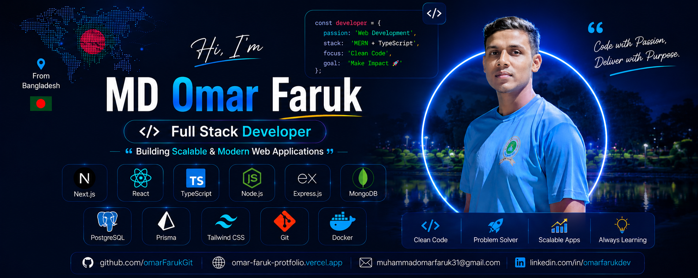

  

<h1 align="center">Hi 👋, I'm MD Omar Faruk</h1>
<h3 align="center">A Passionate Full Stack Developer from Bangladesh 🇧🇩</h3>

  

---

<!--- about --->
- 👋 Hi, I’m **[@omarFaruk](https://github.com/omarFarukGit)**
- 🖥️ I’m currently working on **React.js, Next.js, Typescript and Redux** for frontend development.
- 🗄️ Using **Node.js, Express.js, MongoDB, Mongoose, PostgreSQL, and Prisma** for the backend.
- 🛠️ I’m currently learning ** Docker and AWS**.
- 💬 Ask me about **Full-Stack (React, Next, Node, Express, MongoDB, PostgreSQL)**.
- 🌐 Explore My Portfolio **[OmarFaruk](https://omar-faruk-protfolio.vercel.app/)** and My **[Resume](https://drive.google.com/file/d/1Bla2FYGJYkiT6IHYPgTBTTzn5g1uL315/view?usp=sharing)**
- 📝 I regularly write articles on **[LinkedIn](https://www.linkedin.com/in/omarfarukdev/)**
- 📫 Feel free to reach me out **[Email](muhammadomarfaruk@gmail.com)**

## 🔭 Current Activities

- 🌱 Exploring Next.js 15 and TypeScript
- 🚀 Building a Tourism Management Website
- 📚 Learning PostgreSQL and Prisma ORM
- 💡 Improving Backend Architecture with Express.js
- ⚡ Practicing Data Structures and Problem Solving

---

## 👨‍💻 Portfolio & Contact

- 🌐 Portfolio: https://omar-faruk-protfolio.vercel.app/
- 📫 Email: muhammadomarfaruk31@gmail.com

---

## 🌐 Connect With Me

  
  
  
  
  

---

<!--- technology --->
##  <b> TECHNOLOGY STACK:</b>

### Languages:

### CSS Frameworks & Libraries:

### JavaScript Frameworks & Libraries:

### Database & Model:

### Deployment Platform:

### Design & Graphics:

### Tools & Technologies:

 

<!--- statistics --->
## <b> GITHUB STATISTICS & ANALYSIS:</b>

### GitHub Contributions:

### GitHub Statistics:
|  |  |
| ------------- | ------------- |

 

  
  

---

## 🔥 GitHub Streak

  

---

## 🏆 GitHub Trophies

  

---

  <b>✨ Code • Learn • Build • Improve ✨</b>

